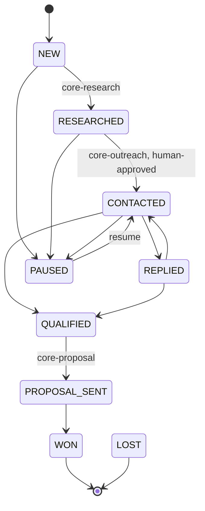

# AI Engine

Four packages — research, outreach, scoring, proposals — plus the acquisition state machine that sequences them. All are pure domain modules: each takes its model as an interface, so every test runs against a fake and **no live Anthropic call has ever been made from this repository**.

Model: `claude-opus-5`, `thinking: { type: 'adaptive' }`, streaming. Overridable per call.

Every live stage may also go to `LOST` or `PAUSED`. Only `PROPOSAL_SENT` may reach `WON` — a deal that never had a proposal cannot be won, which stops the pipeline being "fixed" by dragging a card to closed. `CONTACTED` does not advance on its own; following up is what happens *in* `CONTACTED`, which is why there is no `FOLLOWING_UP` state. `packages/core-acquisition/src/stages.ts`

## Research — the classification is the product

Every claim carries one of three labels, and the Zod schema enforces what each one owes:

| Label | Requires | Forbids |
|---|---|---|
| `OBSERVED` | a value, **and at least one quote with a source URL** | — |
| `INFERRED` | a value, **and `basis`** naming the observations it reasoned from | evidence; confidence above 80 |
| `UNKNOWN` | `value: null`, confidence 0 | a value; evidence |

This is the whole design. A model can write `OBSERVED` on anything; what makes the label mean something is that an `OBSERVED` claim without a citation **fails validation**, and the failure message is fed back as a repair prompt. The confidence ceiling on `INFERRED` closes the obvious escape: if you are more certain than 80, cite it and mark it observed.

`observedShare()` reports the ratio of observed claims — a low ratio means thin research, visible to the operator rather than buried.

### Retry versus repair

These are different failures and the code treats them differently (`researcher.ts`):

- **Provider failure** (network, 5xx, timeout) → exponential backoff with **full jitter**, so a rate-limited batch does not retry in lockstep.
- **Validation failure** → the issues are appended to the conversation as a repair message and the model tries again. Backing off would not help; the model needs to be told what was wrong.
- **Refusal** (`stop_reason: 'refusal'`, arriving on an HTTP 200) → **terminal**. Retrying a refusal is futile and looks like evasion.

Three typed errors: `ResearchProviderError` (has `retryable`), `ResearchValidationError` (carries the last issues), `ResearchRefusedError`.

## Outreach — generated, then checked, then approved by a person

Generation is the easy half. `verify.ts` runs eleven checks on the output before a human ever sees it:

`too-long` · `too-short` · `missing-subject` · `unexpected-subject` · `subject-too-long` · `unsupported-evidence` · `fabricated-number` · `generic-spam` · `no-company-reference` · `multiple-ctas` · `unresolved-placeholder`

Two of these carry the weight:

- **`fabricated-number`** — every significant number in the message must appear in the research it was given. A model that invents "you're losing 40% of leads" is caught mechanically, not by a reviewer's memory.
- **`unsupported-evidence`** — claims about the company must trace to an `OBSERVED` observation.

`generic-spam` matches a phrase list: *"I hope this email finds you well"*, *"just reaching out"*, *"touching base"*, *"circling back"*, *"synergy"*, *"game-changer"*. Presence of any one is disqualifying.

Defects become a repair prompt, the same mechanism as research.

### The approval gate

`DRAFT → APPROVED → SENT`, with `REJECTED` as an exit. `isSendable()` returns true only for `APPROVED`. A human edit is recorded as an edit — the stored message keeps both the model's text and the person's. Every stored message carries the model name, `PROMPT_VERSION` (`outreach-2026-06-24.1`), the timestamp and the research version it was built from, so a bad batch can be traced to the prompt that produced it.

## Scoring — inference is discounted, not disguised

Seven factors, weights summing to exactly 100 (asserted by a test):

| Factor | Weight |
|---|---|
| `icpFit` | 20 |
| `visibleProblem` | 20 |
| `abilityToPay` | 15 |
| `urgency` | 15 |
| `serviceFit` | 15 |
| `evidenceQuality` | 10 |
| `contactability` | 5 |

Bands: **HIGH ≥ 65**, **MEDIUM ≥ 35**, otherwise LOW.

Every input is a `Claim<T>` carrying its own basis, and **an `INFERRED` claim contributes at half weight** (`INFERENCE_DISCOUNT = 0.5`). That is the mechanism that keeps AI inference from being presented as fact: a lead scored entirely on inference cannot reach the same number as one scored on citations, and the returned breakdown shows every factor's raw value, weight and final points, so the operator can see which half of the score is guesswork.

An earlier version of this had a real flaw: `contactability` is always `OBSERVED` (you either have an email address or you don't), so counting it in the evidential ratio added five guaranteed points and made the cap rule nearly dead code. It is now excluded from that ratio.

## Follow-up — nine decisions, and none of them sends

`planFollowUp()` returns a `FollowUpProposal` with one of nine decisions:

`SCHEDULE` · `WAIT` · `STOP_REPLIED` · `STOP_EXHAUSTED` · `STOP_UNSUBSCRIBED` · `STOP_PAUSED` · `STOP_CLOSED` · `STOP_NOT_CONTACTED` · `STOP_NO_CHANNEL`

Each carries **when**, **which channel**, **the angle the message should take**, and **why** — the reason is present on every stop, not only on schedules.

Channels escalate rather than repeat: `EMAIL → LINKEDIN → WHATSAPP → INSTAGRAM_DM`, filtered to the channels the lead actually has. A third identical email is noise; a LinkedIn note after two unanswered emails is a different attempt.

The proposal carries `readonly requiresAuthorization: true` — a field that is always true and cannot be set otherwise. It exists so that a caller writing a send path cannot forget the constraint; the type makes the human in the loop structural rather than a convention.

## Proposals

Templates plus version history. `pricing.ts` enforces price integrity — a proposal cannot quote a number the catalogue does not support. `verify.ts` applies the same fabrication checks as outreach. Every version is retained with its model, `PROMPT_VERSION` (`proposal-2026-06-24.1`) and timestamp; editing creates a version rather than overwriting one.

## Dashboard — "what should I do next?"

`nextAction.ts` maps each stage to the one action that moves it, and `STALE_AFTER_DAYS` decides when an opportunity has been sitting too long for its stage. `buildQueue()` orders the operator's day. `metrics.ts` computes conversion across closed opportunities — `TRACK` and `IMPROVE` are reads, not states, because nothing waits in them.

## What is untested

Everything above is verified against fakes and is correct as logic. What has never been measured:

- **Repair rate.** How often generators actually fail validation and retry. Assumed 25–30%. Unmeasured.
- **Token profile.** Research is assumed at ~10,400 input tokens (roughly three source documents). A user pasting ten pages doubles it.
- **Refusal rate.** The refusal path is tested with a fake that returns a refusal; no real refusal has been seen.

These three are the least-tested inputs in the system, and they are exactly the ones [MONETIZATION.md](MONETIZATION.md) prices against. One week of real usage settles all of them.
