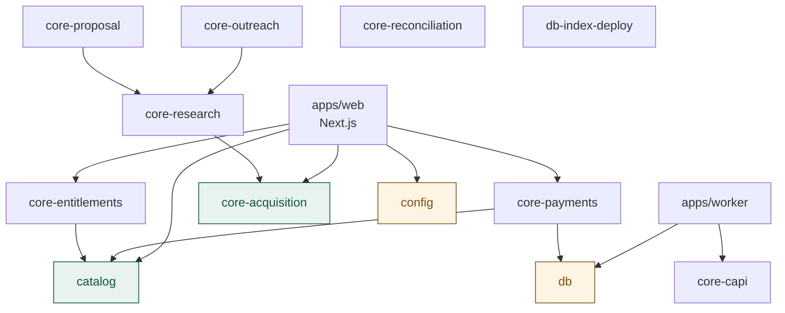
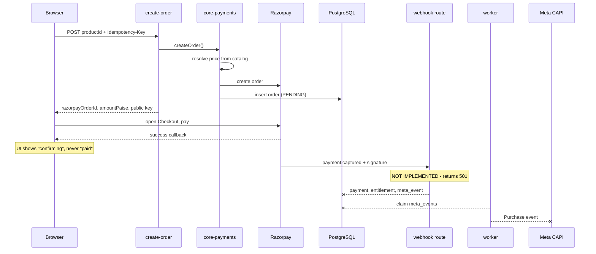
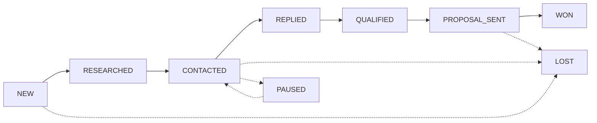

# Architecture

## The organising rule

Domain packages are **pure**: no database, no HTTP, no model calls. Everything touching the outside world is an interface the caller supplies — `OrderRepository`, `HttpTransport`, `MessageGenerator`, `EntitlementRepository`, `ResearchModel`.

This is why 747 unit tests run in seconds with no fixtures, and why scoring, cadence and retry policy — the rules most likely to be tuned after real use — can change without a database.

## Package graph

`core-acquisition` and `catalog` are entirely pure. The three AI packages each isolate their Anthropic dependency to one adapter file.

## Commerce flow

The webhook step is the architecture's single point of trust and is **not implemented**. Everything downstream is unreachable in production.

## Acquisition engine flow

`Opportunity` carries the stage, not `Lead` — a lead can generate several opportunities over time. Following up happens *within* `CONTACTED` rather than as its own state.

## What is implemented

| Area | State | Tests |
|---|---|---|
| Order creation, idempotency, price authority | Implemented | 27 |
| Checkout UI, state machine, failure/retry | Implemented | 167 |
| Razorpay signature verification | Implemented, **no caller** | 42 |
| Meta CAPI purchase events + dedup | Implemented, **no caller** | 6 |
| Meta event worker (claim/lease/fence/retry) | Implemented, **no poll loop** | 66 |
| Entitlements, access tokens, downloads | Implemented, **no grant caller** | 55 |
| Duplicate reconciliation | Implemented | 28 |
| Concurrent unique index deployment | Implemented | 47 |
| Acquisition engine + dashboard | Implemented, **no repositories** | 137 |
| AI research / outreach / proposals | Implemented, **never called live** | 106 |

## What is stubbed

These exist and **throw**:

| Function | File |
|---|---|
| `handleRazorpayWebhook` | `packages/core-payments/src/index.ts:87` |
| `verifyCheckoutReturnSignature` | `packages/core-payments/src/index.ts:67` |
| worker `main()` | `apps/worker/src/index.ts:22` |
| `capiDispatcher` | `apps/worker/src/dispatchers/capiDispatcher.ts` |
| `deliveryDispatcher` | `apps/worker/src/dispatchers/deliveryDispatcher.ts` |
| `withCorrelationId` | `packages/observability/src/index.ts:36` |

## Invariants the database enforces

Application code can be wrong; these hold regardless. Detail in [DATABASE.md](DATABASE.md).

- A payment must match its order's amount and currency
- An order's amount, currency and product freeze once a payment exists
- A Meta event requires a CAPTURED payment
- An entitlement requires a CAPTURED payment and must match its order's product and customer
- Nothing reaches `SENT` without a named approver
- One CAPTURED payment per order
