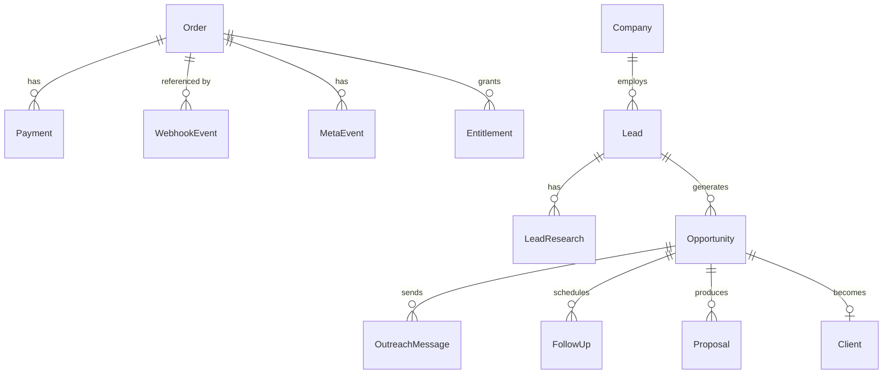

# Database

PostgreSQL 16. Prisma is used for schema and migrations; several operations are hand-written SQL because Prisma cannot express them.

## Models

Seventeen models in two groups.

**Commerce** — `Order`, `Payment`, `WebhookEvent`, `MetaEvent`, `IdempotencyReconciliation`, `ProductionIndexMigration`

**Acquisition** (`acq_*` tables) — `User`, `Company`, `Lead`, `LeadResearch`, `Opportunity`, `OutreachMessage`, `FollowUp`, `Conversation`, `Proposal`, `Client`, `Activity`



Customer and product data is denormalised onto `Order` rather than normalised into users and products tables — the funnel's catalogue is a small fixed set, not a lifecycle.

## What the database enforces

These are triggers and constraints, not application rules. They hold against a buggy handler, an admin script, or a `psql` session.

| Rule | Where | Migration |
|---|---|---|
| `amount_paise > 0` on orders and payments | CHECK | 0001 |
| One CAPTURED payment per order | Partial unique index | 0001 |
| Unique `razorpay_payment_id`, `razorpay_event_id`, `meta_event_id` | Unique indexes | 0001 |
| Payment amount and currency must equal its order's | Trigger `payments_match_order` | 0003 |
| Order financials freeze once a payment exists | Trigger `orders_financials_frozen` | 0003 |
| Meta event requires a CAPTURED payment | Trigger `meta_events_require_capture` | 0003 |
| Entitlement requires a CAPTURED payment | Trigger `entitlements_require_capture` | 0004 |
| Entitlement must match its order's product and customer | Trigger `entitlements_match_order` | 0004 |
| Entitlement emails are lowercase | CHECK | 0004 |
| Nothing is SENT without an approver | Trigger `outreach_send_requires_approval` | 0005 |
| A paused opportunity records why and from where | CHECK | 0006 |

**Why triggers.** The webhook handler is unwritten. Putting these in application code would mean they arrive whenever it does, and protect nothing if it is written incorrectly.

## Idempotency keys

| Table | Key | Purpose |
|---|---|---|
| `orders` | `idempotency_key` | Retried checkout returns the same order |
| `payments` | `razorpay_payment_id` | A payment cannot be recorded twice |
| `webhook_events` | `razorpay_event_id` | Webhook replay is rejected |
| `meta_events` | `meta_event_id` | Deterministic, so Meta deduplicates |
| `entitlements` | `(customer_email, product_slug)` | Duplicate purchase is a no-op |

## Local setup

```bash
docker compose up -d postgres
pnpm db:generate
pnpm db:migrate:deploy
```

`pnpm db:studio` opens Prisma Studio.

## Known gaps

- **Eleven of seventeen models have no repository.** The acquisition engine is pure domain logic; nothing reads or writes `acq_*`.
- **`prisma generate` has never succeeded in this repository's development environment** (`binaries.prisma.sh` is blocked). `apps/web/app/api/payments/create-order/route.ts:43` uses `prisma as never` to work around it — remove that cast once generate runs.
- **No retention or deletion path** for the acquisition tables, which hold third-party personal data.
