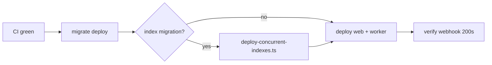

# Deployment

> **Nothing here has been deployed, and no container has ever been built.** Both Dockerfiles say so in their own first comments ("NOT exercised in CI yet"). This document describes what exists and what it would take — not a procedure anyone has run.

## What exists

| Artifact | State |
|---|---|
| `apps/web/Dockerfile` | Multi-stage skeleton, never built |
| `apps/worker/Dockerfile` | Multi-stage skeleton, never built |
| `docker-compose.yml` | Postgres 16 for local dev. Web and worker services are **commented out** |
| `docker-compose.test.yml` | Ephemeral Postgres on port 5433, `tmpfs` data — for tests only |
| `infra/github-actions/ci.yml` | Lint/typecheck job + test job with a Postgres service. Deploy job commented out |
| `infra/migrations-runbook.md` | The migration procedure |

## Blockers before any deploy

These are ordered by what stops you first.

1. **The webhook handler returns 501.** `apps/web/app/api/webhooks/razorpay/route.ts` — no payment is ever confirmed, no entitlement is ever granted. Deploying this means taking money and delivering nothing. This is the blocker; everything else is secondary.
2. **The worker's `main()` throws.** `apps/worker/src/index.ts:22` — the event loop that drains the outbox does not exist. The per-event logic is complete and tested; the loop around it is not.
3. **`.dockerignore` is missing**, so the first image build bakes `.env` into a layer. See [SECURITY.md](SECURITY.md) C-1. Fix before the first build, not after.
4. **`pnpm test` fails**, so CI cannot go green. See [TESTING.md](TESTING.md).
5. **No migration has ever been applied.** ~400 lines of PL/pgSQL are unparsed.

## Known defects in the Dockerfiles

Both files share the same shape and the same problems:

```dockerfile
FROM base AS deps
COPY package.json pnpm-workspace.yaml pnpm-lock.yaml* ./
COPY packages ./packages
RUN pnpm install --frozen-lockfile --filter @acos/web...

FROM base AS build
COPY --from=deps /app /app
COPY . .                      # ← no .dockerignore restrains this
RUN pnpm --filter @acos/web run build

FROM base AS runtime
COPY --from=build /app /app   # ← ships devDependencies and sources
EXPOSE 3000                   # ← no USER, so uid 0
```

- `COPY . .` with no `.dockerignore` — **critical**, see above.
- The runtime stage copies the whole build stage, so dev dependencies, test files and sources all ship. For `apps/web`, `output: 'standalone'` in `next.config.mjs` plus a copy of `.next/standalone` is the intended shape.
- Neither runtime stage sets `USER node`, so both processes run as root.
- The worker's `CMD` is `node apps/worker/dist/index.js`, but the web image's `CMD` shells out through `pnpm`, which leaves pnpm as PID 1 and complicates signal handling. The worker holds leases; it needs SIGTERM to reach the process.

## CI, as written

The `test` job starts Postgres 16 and sets `DATABASE_URL`, then runs `pnpm db:generate`, `pnpm test`, `pnpm test:integration`. It has a stale TODO where `pnpm db:migrate:deploy` belongs — first migration now exists, so **integration tests would run against an empty schema and fail**. Uncomment that step.

The deploy job is commented out in full. Its own comment records the rule that matters: `prisma migrate deploy` runs as **its own job before the new app version receives traffic**, never as a side effect of app startup.

## The deploy order that the design requires



Migrations run first and separately, because a new app version that expects a column the database does not have fails on its first request. Concurrent index builds run *outside* the migration runner (they cannot be in a transaction) — see [MIGRATIONS.md](MIGRATIONS.md).

## Runtime shape

Two processes, both stateless, both needing `DATABASE_URL`:

- **web** — Next.js. Horizontally scalable. Holds no locks.
- **worker** — long-running. Safe to run multiple replicas: claiming uses `FOR UPDATE SKIP LOCKED` with leases and fencing tokens, so replicas partition the queue rather than duplicating it. See [WORKERS.md](WORKERS.md). It must be allowed to finish an in-flight event on SIGTERM; killing it mid-send is survivable (the lease expires) but produces a retry that may double-send to Meta — dedup by `event_id` covers that.

Scale the worker on `PENDING` depth, not CPU.

## Environment

All 14 variables in `packages/config/src/env.ts` are required at boot except the five with defaults (`NODE_ENV`, `PORT`, `LOG_LEVEL`, the three `WORKER_*`, `META_CAPI_API_VERSION`) and the optional `OTEL_EXPORTER_OTLP_ENDPOINT`. `loadEnv()` throws on anything missing, which is the behaviour you want: the process dies at boot rather than during a payment.

**`ANTHROPIC_API_KEY` is absent from that schema** despite being required by three packages. Add it before deploying anything that calls a model.

Full table in the [README](../README.md).

## Failure recovery

| Symptom | Where to look | Action |
|---|---|---|
| Meta events stuck `PENDING` | Worker running? `DATABASE_URL` reachable? | Restart the worker; claiming is idempotent |
| Events `PENDING` with `attempts` climbing | `last_error` on the row | A 4xx from Meta is a payload bug — fix and reset `attempts`; a 5xx resolves itself |
| Events at `FAILED` | Exceeded max attempts | Investigate before resetting; these are not retried automatically by design |
| A lease looks stuck | `locked_until` in the past but `SENT` never reached | The worker died mid-send. It expires on its own; fencing stops the dead worker's late write |
| Index build left `INVALID` | `pg_index.indisvalid` | The script prints the exact `DROP INDEX CONCURRENTLY`. **It will not run it for you** |
| Duplicate payments suspected | Run reconciliation | It is **read-only** against business tables — it reports, it never repairs |

Reconciliation writing nothing is deliberate: an automated repair that guesses wrong about money is worse than a report a human acts on.
