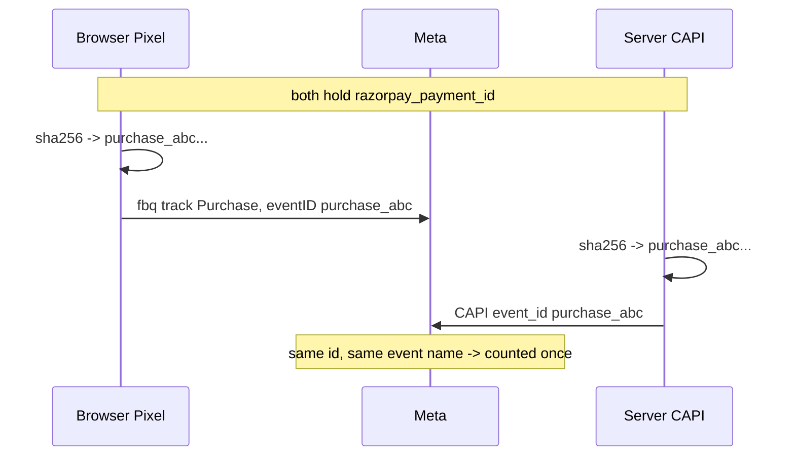

# Meta Conversions API

`packages/core-capi` sends server-side `Purchase` events. Implemented and tested; **nothing calls it**, because the webhook handler that would enqueue events does not exist.

## Deduplication

Meta collapses a browser Pixel event against a server CAPI event when both carry the same `event_id`. Get this wrong and every sale counts twice, which corrupts reported ROAS and teaches the optimiser to bid on a conversion rate that does not exist.

Both sides derive the id from a value they already share:

```
purchase_<sha256 hex of the trimmed razorpay payment id>
```

| Side | Implementation |
|---|---|
| Server | `buildPurchaseEventId({ paymentId })` — Node `crypto` |
| Browser | `derivePurchaseEventId(razorpayPaymentId)` — Web Crypto |

`apps/web/src/analytics/eventId.test.ts` asserts the two produce **byte-identical output** across four payment-id shapes plus whitespace normalisation. Changing one without the other fails CI.

Nothing is transmitted between browser and server to achieve this, and a retry on either side reproduces the same id.



## The payload

`sendMetaPurchase` sends `event_name: Purchase`, `action_source: website`, the stable `event_id`, and:

- **user_data** — SHA-256 hashed email and phone, plus `client_ip_address`, `client_user_agent`, `fbp`, `fbc`
- **custom_data** — `content_ids`, `contents`, `content_name`, `content_type: product`, `value` (rupees, not paise), `currency`

`event_time` is the **payment capture time**, not the retry time. Using the retry time would drift Meta's dedup window.

### PII split

| Channel | Sends |
|---|---|
| Browser Pixel | `content_ids`, `content_type`, `value`, `currency`. **No identifiers.** Matching is via `fbp`/`fbc`. |
| Server CAPI | Email and phone, SHA-256 hashed. Server matching materially improves attribution; hashing is what makes it acceptable. |

`assertNoPii` in `apps/web/src/analytics/funnelEvents.ts` rejects anything resembling a direct identifier in a Pixel payload, including nested objects and underscore variants.

## Transport

`packages/core-capi/src/transport.ts` — the access token goes in the **request body**, never the URL, so it cannot land in proxy or access logs. An `AbortController` enforces a 10-second default timeout. Non-JSON responses and aborts raise distinct typed errors.

Success requires `events_received === 1`; anything else is a `MetaCapiResponseError`.

## Attribution

`apps/web/src/analytics/attribution.ts` captures `utm_source`, `utm_medium`, `utm_campaign`, `utm_content`, `_fbp` and `_fbc` on landing and carries them for the session. First touch wins for UTM; `fbp`/`fbc` refresh.

When `_fbc` is absent — the Pixel has not loaded, or is blocked — it is reconstructed from `?fbclid` as `fb.1.<timestamp>.<fbclid>`, so a fast or blocked conversion does not lose click attribution.

## Known issue

`META_PIXEL_ID` is interpolated into the CAPI URL path with only a non-empty check (`packages/core-capi/src/index.ts:89,135`). It is operator-supplied, so not attacker-reachable, but a malformed value silently retargets the path. Constrain it to `^\d+$`.
