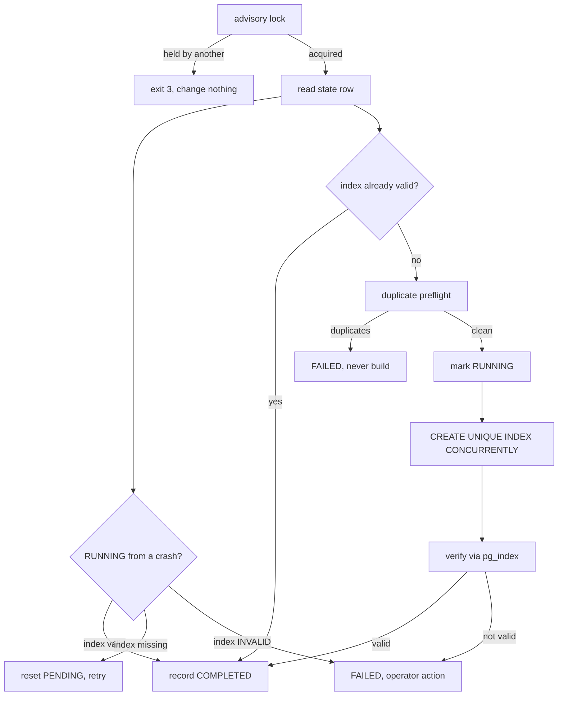

# Migrations

Six migrations, hand-authored SQL under `packages/db/prisma/migrations/`.

> **None have ever been applied.** No PostgreSQL has been available in the development environment. Migrations 0003–0006 contain roughly 400 lines of PL/pgSQL that the database has never parsed. Apply them to a scratch database before anything else.

| Migration | Lines | Contents |
|---|---|---|
| `0001_init` | 186 | All commerce tables, enums, indexes, the `amount_paise` CHECKs, the one-CAPTURED-payment-per-order partial index |
| `0002_concurrent_unique_indexes` | 51 | The four unique indexes — **empty databases only**, see below |
| `0003_payment_integrity_constraints` | 151 | Triggers: payment matches order, order financials freeze, Meta event requires capture |
| `0004_entitlements` | 160 | `entitlements`, `access_tokens`, and their triggers |
| `0005_outreach_provenance` | 106 | Channel enum additions, provenance and approval columns, the send gate |
| `0006_opportunity_lifecycle` | 73 | Replaces the stage enum, adds pause provenance |

## Applying them

```bash
docker compose up -d postgres
pnpm db:migrate:deploy
```

For local development with schema changes, `pnpm db:migrate:dev`.

## 0002 is different — read before deploying

`0002` uses plain `CREATE UNIQUE INDEX`, which takes an **ACCESS EXCLUSIVE lock** for the duration of the build. On an empty table that is microseconds. On a production table with traffic it blocks every read and write until it finishes.

**On an existing database with data, do not apply 0002 through Prisma.** Use the operational script instead:

```bash
DATABASE_URL=... pnpm db:indexes:verify    # dry run first
DATABASE_URL=... pnpm db:indexes:deploy
pnpm --filter @acos/db exec prisma migrate resolve --applied 0002_concurrent_unique_indexes
```

The script uses `CREATE UNIQUE INDEX CONCURRENTLY`, which cannot run inside a transaction — which is why it is a standalone script rather than a migration.

### Why not a Prisma directive

No transaction-disabling directive was found in the installed Prisma **5.22.0** CLI when searched. The native schema-engine binary was not present to inspect further. This system therefore does not depend on one existing: the concurrent build is owned by the script, and Prisma is told the outcome afterwards via `migrate resolve`.

## The concurrent index deployment



Four properties worth knowing:

- **It never drops a suspicious index.** An `INVALID` index — the signature of a failed concurrent build — blocks the target and prints the exact `DROP INDEX CONCURRENTLY` for a human to run. The script will not run it.
- **Preflight refuses to start** when duplicates exist, because a unique build does not fail fast: it completes a full pass and *then* errors, leaving an INVALID index behind.
- **It verifies after building** rather than trusting the statement. A build that reports success but leaves `indisvalid = false` is recorded as FAILED.
- **It is re-runnable.** State lives in `production_index_migrations`, keyed on `(migration_name, index_name)`.

## Enum changes

- `0005` adds values with `ALTER TYPE ... ADD VALUE`. Since PostgreSQL 12 this **may** run inside a transaction; what is forbidden is *using* the new value in the same transaction. This migration only adds them, so Prisma can apply it normally.
- `0006` **replaces** the stage enum by creating a new type and swapping the column, because three values were renamed and two removed, and PostgreSQL has no `DROP VALUE`. Old values are mapped, not discarded: `PERSONALIZED → RESEARCHED`, `FOLLOWING_UP → CONTACTED`.

## Rollback

Adding a unique index is reversible with `DROP INDEX CONCURRENTLY`. **The data it rejects is not.** Once `meta_events_order_id_key` exists, writes that would duplicate an order start failing. Preflight is what makes that safe to discover before the build rather than during it.

The trigger migrations (0003–0005) are reversible by dropping the trigger and its function. The enum replacement in 0006 is not cleanly reversible once rows use the new values.
