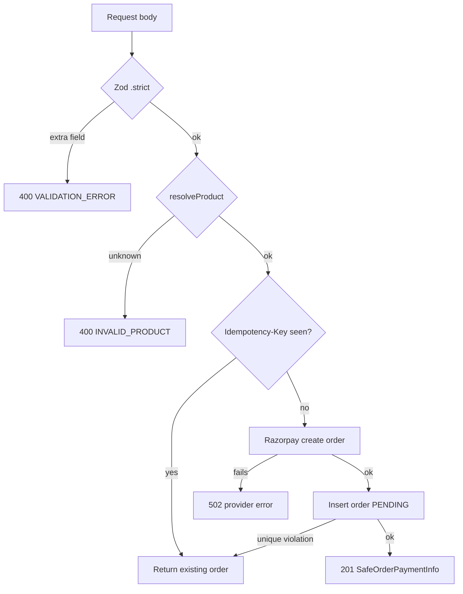

# Payments

Razorpay, INR only. Three one-time products; no subscriptions are implemented.

## Catalogue

`packages/catalog` is the only authority on price. Nothing else may hardcode or recompute an amount.

| Product | `amountPaise` | Display |
|---|---|---|
| `ai_income_99` | 9900 | ₹99 |
| `ai_freelancing_499` | 49900 | ₹499 |
| `ai_client_acquisition_1499` | 149900 | ₹1,499 |

Amounts are integers entered by hand, never `rupees * 100` at runtime — there is no floating-point arithmetic anywhere in the payment path.

## Order creation

`POST /api/payments/create-order` → `core-payments.createOrder()`

### The client has no price authority

Three independent mechanisms:

1. **The request schema is `.strict()`** — a body containing `amount`, `amountPaise`, `price` or `currency` is *rejected*, not ignored. A client sending a price is treated as suspicious, not humoured.
2. **The browser never transmits one.** `buildCreateOrderRequest` constructs the body by listing fields explicitly rather than spreading input.
3. **Razorpay is called with the catalog amount**, and the browser opens Checkout with the figures the *server* returned.

### The response

`SafeOrderPaymentInfo` deliberately omits customer email, phone and timestamps. The only key returned is `razorpayKeyId`, which is Razorpay's public key.

## Idempotency

The `Idempotency-Key` header is optional. When present, a repeated request returns the original order rather than creating a second.

Two concurrent requests with the same key are safe: the loser catches the unique-constraint violation and re-reads the winner's row. One consequence is recorded honestly in the code — the losing request's Razorpay order is orphaned on Razorpay's side, a bounded cost of this strategy.

> **Open issue.** The key is client-chosen and matched globally, not scoped to the customer. A client using a predictable key allows another party to retrieve their `orderId` and `razorpayOrderId`. Fix: match on `(idempotencyKey, customerEmail, productSlug)`. See [SECURITY.md](SECURITY.md).

## Checkout UI

`apps/web/src/checkout/` — a pure reducer plus a thin client component.

States: `idle → creating → opening → confirming`, with `dismissed` and `failed` both returning to `idle` on retry.

**The browser never learns that a payment settled.** Razorpay's success callback moves the UI to `confirming`, which unlocks nothing. `isPurchaseConfirmed()` returns `false` for every state, with a test iterating all six plus forged events.

## Not implemented

| Function | Consequence |
|---|---|
| `handleRazorpayWebhook` | No payment is ever recorded. Checkout charges the card and the customer receives nothing. |
| `verifyCheckoutReturnSignature` | The optimistic thank-you page cannot verify the return signature. It grants nothing either way. |
