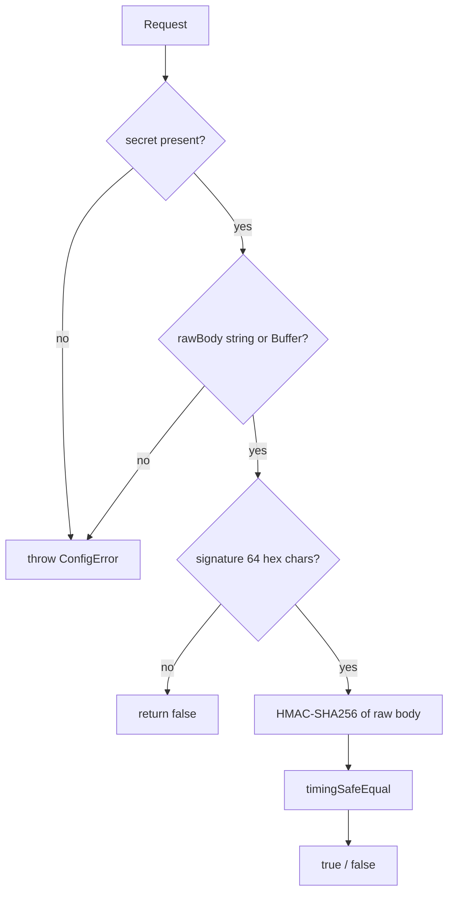

# Webhooks

`POST /api/webhooks/razorpay` — the architecture's single trusted source of payment truth.

> **This route returns 501. The handler behind it throws.** Everything below describes what exists and what the implementation must do.

## Signature verification — implemented, unwired

`apps/web/src/lib/razorpay/verifySignature.ts` is complete and has 42 tests. It has **zero production callers**.

Three deliberate properties:

- **Timing-safe.** `timingSafeEqual` on 32-byte buffers.
- **Length-guarded.** A strict `^[0-9a-f]{64}$` check runs before any crypto. Node's `Buffer.from(str, 'hex')` silently truncates malformed input, which would otherwise let two different-length signatures reach `timingSafeEqual` and throw.
- **Raw-body typed.** `rawBody` is `string | Buffer`, so passing a parsed object is a compile error.

A configuration error (missing secret) **throws**; a bad signature **returns false**. These are different failures and are not conflated.

## What the handler must do

1. Read `await request.text()` — never `request.json()` before verification, or the HMAC covers the wrong bytes.
2. Verify against `RAZORPAY_WEBHOOK_SECRET`.
3. Dedupe on `razorpay_event_id`.
4. In one transaction: upsert the payment, grant the entitlement, insert the `meta_event`.
5. Respond 200 quickly. No CAPI call or email inline — that is the worker's job.

## Replay and idempotency

Handled structurally rather than in code:

| Attack | Defence |
|---|---|
| Replay the same event | `webhook_events_razorpay_event_id_key` unique index |
| Reuse a payment id across orders | `payments_razorpay_payment_id_key` |
| Two concurrent identical webhooks | Same unique indexes — one insert wins, one fails |
| Double-capture one order | `payments_one_captured_per_order` partial unique index |
| Duplicate Meta conversion | Deterministic `meta_event_id` + unique index |

Several distinct events for one payment are *deliberately* stored separately. Event-level dedup must not collapse them; payment-level idempotency is a separate concern.

## Freshness

There is **no timestamp or nonce window check** and none is planned. Replay is prevented by event-id uniqueness rather than by freshness. If Razorpay's signature scheme is ever found to permit replay of an unseen event id, this becomes a gap.

## Tests

`tests/integration/webhook.integration.test.ts` — 13 tests. Nine run against real PostgreSQL (unique-index behaviour, concurrency, multi-event-per-payment); four are `it.todo` naming the handler behaviour that must exist.
