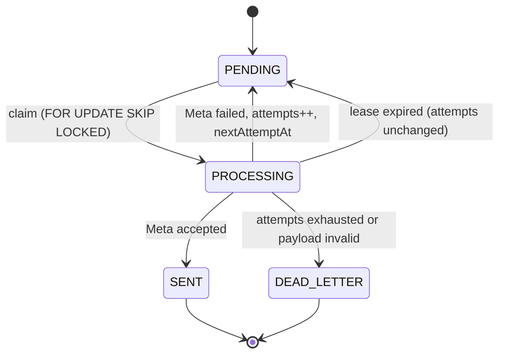

# Workers

`apps/worker` dispatches queued Meta events. The claiming, leasing, fencing and retry logic is complete with 66 tests. **The entrypoint throws** — there is no poll loop.

## The state machine



`claim` only ever selects `PENDING`, so a `SENT` event is not merely unlikely to be reprocessed — it is unreachable.

## Claiming

One statement, so two workers can never take the same row:

```sql
UPDATE meta_events SET status='PROCESSING', lease_owner=$1, lease_expires_at=$2
 WHERE id IN (
   SELECT id FROM meta_events
    WHERE status='PENDING' AND next_attempt_at <= $3
    ORDER BY next_attempt_at, created_at
      FOR UPDATE SKIP LOCKED LIMIT $4)
RETURNING ...
```

## Leases and fencing

A row lock dies with its transaction; a crashed worker mid-dispatch would hold nothing. So a **5-minute lease** is stored on the row alongside it.

Every terminal write is conditional:

```sql
WHERE id = $1 AND status = 'PROCESSING' AND lease_owner = $2
```

Zero rows updated means *you were fenced* — your lease expired, the row was recovered, another worker owns it. The worker discards its result.

The expiry check is deliberately **not** in that clause. If a worker overruns its lease but nobody has reclaimed the row, it still owns `lease_owner`, and letting it write `SENT` prevents a duplicate send. It is `releaseExpiredLeases` nulling `lease_owner` that does the fencing — the moment the row genuinely changes hands.

## Retry

Full jitter, so a Meta outage does not produce a synchronised retry storm.

| Attempt | Cap |
|---|---|
| 0 | immediate |
| 1 | ≤ 1 minute |
| 2 | ≤ 5 minutes |
| 3 | ≤ 15 minutes |
| 4 | ≤ 60 minutes |
| 5 | DEAD_LETTER |

**`attempts` increments only on a genuine Meta failure.** Lease recovery leaves it untouched — a crashed worker is no evidence Meta rejected anything. A locally invalid payload dead-letters immediately without spending budget, since retrying cannot fix it.

## Post-send database failure

If Meta accepts but `markSent` fails, the error propagates and the row stays `PROCESSING`. The lease timer — not a lost update — owns recovery, and the event is re-sent later under the **same** `metaEventId`, so Meta deduplicates. The cost is a duplicate HTTP request; the alternative risks silently dropping a conversion.

## To implement the loop

`loadEnv()`, then on `WORKER_POLL_INTERVAL_MS`:

```ts
await releaseExpiredLeases(deps);
for (const event of await claimMetaEvents(deps, batchSize)) {
  await processMetaEvent(deps, event);
}
```

All four functions exist and are exported from `apps/worker/src/metaEvents`.

> **Note.** `WORKER_MAX_ATTEMPTS` defaults to 8 in `packages/config`, but this worker uses `MAX_ATTEMPTS = 5`. The env var is currently unread.

## Tests

66 unit tests including 35 failure-mode tests: crash before and after the Meta request, exact lease boundary, stale-worker fencing, post-send database failure, and the full retry schedule. Six real-PostgreSQL concurrency tests exist in `tests/integration/meta-event-worker.concurrency.test.ts` and **have never been run** — see [TESTING.md](TESTING.md).
